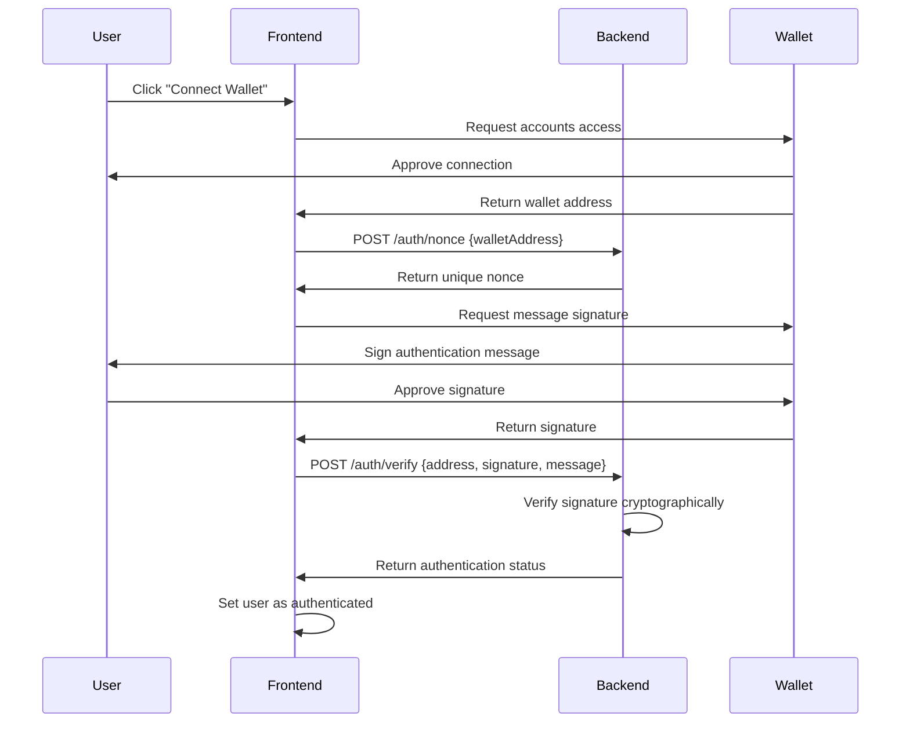

# Decentralized Social Media Platform

A full-stack Web3-powered social media application with **RainbowKit-style wallet authentication** using ethers.js, built with React/Next.js frontend and NestJS backend.

## Demo Video Link: https://go.screenpal.com/watch/cT1XQznXoiC

## 🚀 Features

### 🔐 **Wallet Authentication (RainbowKit-style)**
- **Ethereum wallet as sole identity provider** - No traditional email/password login
- **Signature-based authentication** - Users sign a message to prove wallet ownership
- **Nonce verification** - Prevents replay attacks with server-generated nonces
- **Multi-wallet support** - MetaMask and other Web3 wallets
- **Persistent sessions** - Automatic reconnection on page refresh
- **Account switching** - Handles wallet account changes seamlessly

### 📱 **Core Social Features**
- **User Profiles** - Username, bio, profile picture with wallet address as unique ID
- **Posts** - 280-character text posts with timestamps
- **Interactions** - Like and comment functionality
- **Feed** - Consolidated chronological post display
- **Real-time Updates** - Live interaction counts and new posts

## 🛠️ **Tech Stack**

### **Frontend**
- **Next.js 15** - React framework with App Router
- **TypeScript** - Type-safe development
- **Tailwind CSS** - Modern, responsive UI design
- **Web3 Context** - Global wallet state management
- **ethers.js patterns** - Ethereum interaction without heavy dependencies

### **Backend**
- **NestJS** - Scalable Node.js framework
- **TypeScript** - End-to-end type safety
- **PostgreSQL** - Robust relational database
- **TypeORM** - Database ORM with decorators
- **Class Validator** - Request validation

### **Database Schema**
- `users` - User profiles linked to wallet addresses
- `posts` - User-generated content
- `likes` - Post interaction tracking
- `comments` - Threaded discussions

## 🏗️ **Architecture**

### **Wallet Authentication Flow**


### **Project Structure**
```
arena/
├── backend/                 # NestJS API Server
│   ├── src/
│   │   ├── auth/           # Wallet signature verification
│   │   ├── users/          # User profile management
│   │   ├── posts/          # Post and interaction logic
│   │   ├── entities/       # TypeORM database models
│   │   └── dto/            # Request/response validation
│   ├── database/schema.sql # Database schema
│   └── .env               # Environment configuration
├── frontend/               # Next.js React App
│   ├── src/
│   │   ├── app/           # Next.js App Router pages
│   │   ├── components/    # Reusable UI components
│   │   ├── contexts/      # Web3 state management
│   │   ├── types/         # TypeScript interfaces
│   │   └── lib/           # Utility functions
└── README.md
```

## 🚀 **Quick Start**

### **Prerequisites**
- Node.js 18+
- PostgreSQL 12+
- MetaMask or another Web3 wallet

### **1. Database Setup**
```bash
# Create PostgreSQL database
createdb decentral_social

# Run schema (from project root)
psql decentral_social -f backend/database/schema.sql
```

### **2. Backend Setup**
```bash
cd backend
npm install

# Configure environment
cp .env.example .env
# Edit .env with your database credentials:
# DB_HOST=localhost
# DB_PORT=5432
# DB_USERNAME=your_username
# DB_PASSWORD=your_password
# DB_NAME=decentral_social

# Start development server
npm run start:dev
```

### **3. Frontend Setup**
```bash
cd frontend
npm install

# Start development server
npm run dev
```

### **4. Access the Application**
- Frontend: http://localhost:3000
- Backend API: http://localhost:3001

## 🔐 **Wallet Authentication Details**

### **Authentication Process**

1. **Wallet Connection**: User clicks "Connect Wallet" and approves MetaMask connection
2. **Nonce Generation**: Frontend requests a unique nonce from backend for the wallet address
3. **Message Signing**: User signs a formatted message containing the nonce
4. **Signature Verification**: Backend cryptographically verifies the signature matches the wallet address
5. **Session Creation**: Authenticated state is maintained in frontend context

### **Security Features**
- **Cryptographic Proof**: Users prove wallet ownership without revealing private keys
- **Nonce Protection**: Prevents replay attacks with server-generated random nonces
- **No Password Storage**: Zero traditional authentication credentials stored
- **Wallet-based Identity**: Each wallet address represents a unique user account

### **Supported Wallets**
- MetaMask (Primary)
- Any Web3-compatible wallet that supports `eth_requestAccounts` and `personal_sign`

## 📡 **API Endpoints**

### **Authentication**
- `POST /auth/nonce` - Generate authentication nonce for wallet address
- `POST /auth/verify` - Verify wallet signature and authenticate user

### **Users**
- `GET /users/:walletAddress` - Get user profile
- `POST /users` - Create/update user profile
- `GET /users` - List all users

### **Posts**
- `GET /posts` - Get all posts with likes/comments
- `POST /posts` - Create new post
- `GET /posts/:id` - Get specific post
- `POST /posts/:id/like` - Like/unlike post
- `POST /posts/:id/comment` - Add comment to post

## 🎨 **UI/UX Features**

### **Modern Design**
- **Gradient Backgrounds** - Beautiful blue-to-purple gradients
- **Responsive Layout** - Mobile-first design with Tailwind CSS
- **Loading States** - Smooth loading indicators and skeleton screens
- **Empty States** - Helpful messaging when no content exists

### **Wallet UI**
- **Connection Status** - Visual indicators for wallet connection state
- **Address Display** - Formatted wallet addresses (0x1234...5678)
- **Wallet Detection** - Shows wallet type (MetaMask, etc.)
- **Error Handling** - Clear error messages for connection issues

## 🔧 **Development**

### **Adding New Features**
1. **Backend**: Create new modules following NestJS patterns
2. **Database**: Update schema and create TypeORM entities
3. **Frontend**: Add components and update types
4. **API Integration**: Update API calls and error handling

### **Environment Variables**
```bash
# Backend (.env)
DB_HOST=localhost
DB_PORT=5432
DB_USERNAME=your_username
DB_PASSWORD=your_password
DB_NAME=decentral_social
```

## 🚀 **Deployment**

### **Backend Deployment**
- Configure production database
- Set environment variables
- Deploy to your preferred platform (Heroku, Railway, etc.)

### **Frontend Deployment**
- Update API URLs in frontend code
- Deploy to Vercel, Netlify, or similar platform
- Ensure CORS is configured on backend

## 🤝 **Contributing**

1. Fork the repository
2. Create a feature branch
3. Implement your feature with proper TypeScript types
4. Test wallet authentication thoroughly
5. Submit a pull request

## 🔮 **Future Enhancements**

- **Multi-chain Support** - Support for Polygon, Arbitrum, etc.
- **ENS Integration** - Resolve and display ENS names
- **IPFS Storage** - Decentralized storage for images and content
- **Token Gating** - Exclusive features based on token ownership
- **DAO Governance** - Community voting on platform features
- **NFT Profiles** - Use NFTs as profile pictures

## 📄 **License**

This project is open source and available under the [MIT License](LICENSE).

---

**Built with ❤️ for the Web3 community**

*Experience the future of social media where your wallet is your identity and your private keys are your password.* 
